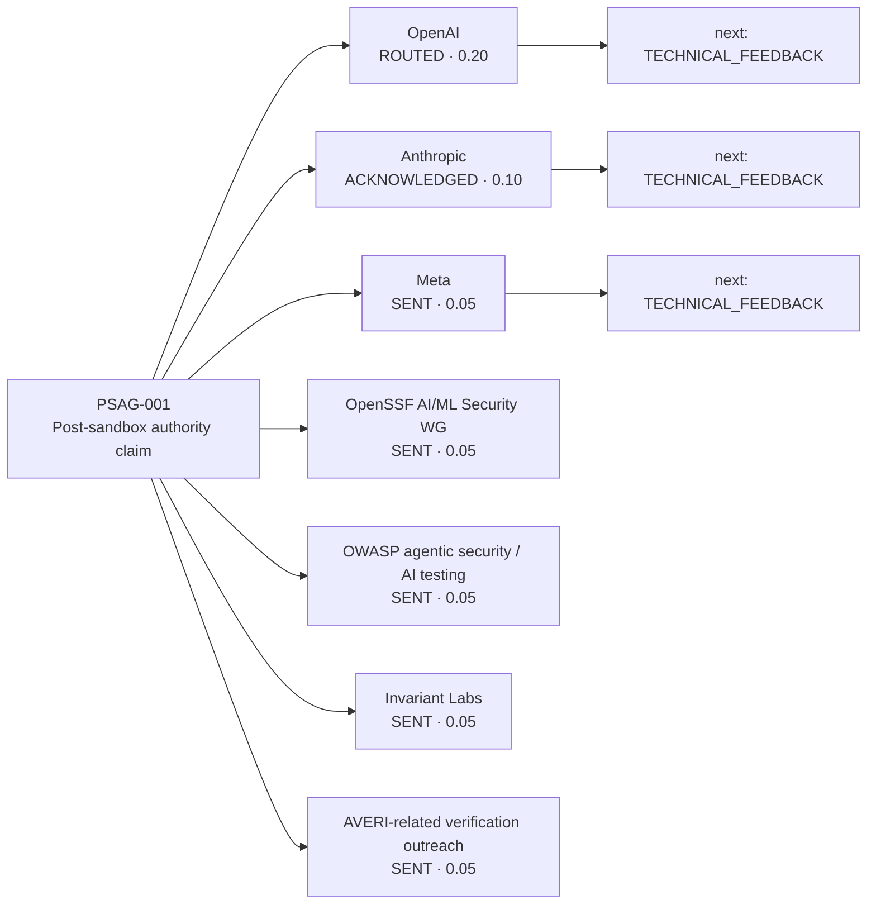
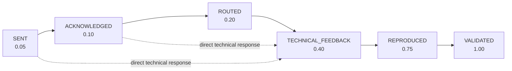
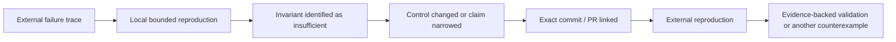

# External Validation Graph v0.1

## Purpose

This graph turns the external review ledger into a causal state-transition model that can be read by humans and later consumed by ProofPath/CML tooling.

The graph tracks **review maturity**, not safety confidence. Outreach has low evidential weight; independent reproduction and explicit validation carry much more weight.

## Claim under review

**PSAG-001**

> A sandbox escape should not automatically become durable permission for an agent to continue accumulating and exercising authority.

## Current graph



## Review-state transition model



A state transition is permitted only when a concrete evidence artifact supports it. Silence never advances the graph.

## External Evidence Weight (EEW-v0.1)

```text
EEW = 100 * Σ(status_weight_i) / N
```

Current state:

- review targets: **7**
- weighted sum: **0.55**
- EEW: **7.86 / 100**

This number is intentionally conservative. It does **not** mean the system is "7.86% safe" or that there is a 7.86% probability the claim is true. It only measures how far the current external-review trail has progressed toward evidence-backed independent validation.

## Why a counterexample can increase evidence value

The goal is falsification, not logo collection.

A reviewer who provides a concrete counterexample may force this sequence:



A criticism that changes the architecture is therefore more valuable than an acknowledgement that leaves the claim untouched.

## Machine-readable source

Canonical machine-readable state for this graph:

- [`external_validation_graph.v0.1.yaml`](./external_validation_graph.v0.1.yaml)
- [`EXTERNAL_REVIEW_LEDGER.md`](./EXTERNAL_REVIEW_LEDGER.md)

## ProofPath mapping

Every external-review transition can become a ProofPath evidence event:

```text
claim_id
  + organization
  + review target
  + timestamp
  + previous status
  + new status
  + evidence reference
  + repository commit / PR
        |
        v
signed / attributable review-transition evidence
```

Suggested event names:

- `review.sent`
- `review.acknowledged`
- `review.routed`
- `review.technical_feedback`
- `review.reproduced`
- `review.validated`

## CML mapping

CML can treat the review process as an append-only causal state machine:

```text
external_validation.PSAG-001
        |
        +-- evidence event t0: Meta SENT
        +-- evidence event t1: OpenAI ROUTED
        +-- evidence event t2: reviewer counterexample
        +-- evidence event t3: local reproduction
        +-- evidence event t4: control revision
        +-- ...
```

The current status should always be recomputed from evidence-backed transitions rather than edited as an unsupported label.

## Invariants

1. No review state advances without explicit evidence.
2. Silence never advances a state.
3. `SENT`, `ACKNOWLEDGED`, and `ROUTED` are not endorsements.
4. `VALIDATED` requires explicit external evidence plus a reproducible artifact link.
5. Counterexamples that narrow or change the claim are positive evidence of a functioning review process.

## Next highest-value transition

The highest-value next event is **not another SENT node**.

It is one of:

1. `TECHNICAL_FEEDBACK` from OpenAI, Anthropic, Meta, OpenSSF, OWASP, Invariant Labs, or an independent verifier;
2. a concrete external failure trace;
3. an independently reproducible benchmark result.

That is the transition that materially increases the graph's evidential weight.
